# Execution Routing

Tools use one of two execution routes based on whether they are local or
provided by an external MCP server.

## Executor Types

| Executor | When | Example |
|----------|------|---------|
| **SimpleExecutor** | Bundled and configured extension tools | `brave.search`, `file.read` |
| **ProxyManager** | External MCP servers defined in config | `github.get_file_contents` |

## Sequence Diagram

```mermaid
sequenceDiagram
    participant R as runner.py
    participant L as tool_loader
    participant S as SimpleExecutor
    participant P as ProxyManager
    participant T as Tool Module
    participant E as External MCP

    R->>L: load_tools(registry)
    L->>L: Scan bundled ottools/*.py
    L->>L: Scan config tools_dir globs
    L-->>R: LoadedTools

    alt Bundled or configured extension tool
        Note over R,T: Imported in the OneTool process
        R->>S: execute(code, namespace)
        S->>T: Direct function call
        T-->>S: Result
        S-->>R: Serialised result

    else External MCP Server
        Note over R,E: Defined in servers.yaml
        R->>P: call_tool(server, tool, args)
        P->>P: Get connected client
        P->>E: MCP tool/call request
        E-->>P: MCP response
        P-->>R: Parsed result
    end
```

## Key Files

| File | Role |
|------|------|
| `src/ot/executor/tool_loader.py` | Discovers and imports local tools, builds LoadedTools |
| `src/ot/executor/simple.py` | In-process execution (fast, no isolation) |
| `src/ot/proxy/manager.py` | Routes calls to external MCP servers |
| `src/ot/executor/pack_proxy.py` | Local and external MCP pack proxies |
