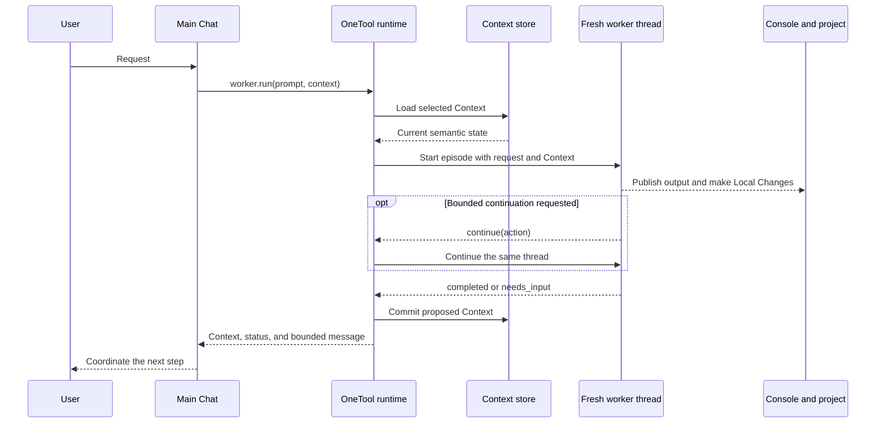

# Epic Worker Architecture

Epic Worker keeps one main Chat with the user while moving substantive work into
short-lived Codex workers. Each worker starts with the active project and one
small named Context instead of inheriting the main Chat or an earlier worker
transcript.

This document describes the implemented feature: its core idea, components,
public surface, channel model, episode lifecycle, persistence, isolation, and
failure behavior. Normative behavior lives in the synced OpenSpec specifications
for `tool-worker`, `worker-contexts`, `skill-use-worker`,
`worker-autonomous-continuation`, `worker-artifact-store`, and
`worker-warm-runtime`.

## The idea in one sentence

The main agent coordinates, a fresh worker handles one episode, and OneTool
carries one explicitly selected project-local Context into that episode.

## Implemented capabilities

- Named project-local Contexts carry current semantic state between otherwise
  fresh worker episodes.
- Bounded same-thread continuation lets a worker finish a concrete episode
  without turning the thread into a durable session.
- Context-owned artifacts preserve explicit evidence outside semantic Context
  and project deliverables.
- A warm app-server runtime reduces startup cost while retaining a fresh,
  deleted thread and an exact isolation boundary for every episode.
- Console, Status, History, Local Changes, and artifacts remain distinct
  channels with no implicit replay into later workers.

## Episode sequence



## Identity model

| Concept | Meaning |
|---|---|
| Project | The effective CWD with its project instructions and current files |
| Chat | The user/main-agent conversation and its selected Context name |
| Context | Durable current semantic state for one named project workstream |
| Episode | One synchronous `worker.run` invocation |
| Thread | Fresh ephemeral Codex conversation used for bounded turns in an episode |

There is no project registry, public worker session, or contextless episode.
Every newly invoked orchestrator selects `default`. A Chat can switch Contexts,
and an explicit run name can override the selection for one episode.

## Main components

| Component | Responsibility |
|---|---|
| Main Chat | Talks with the user and retains one selected Context name |
| `use-worker` skill | Defaults selection, resolves overrides, and delegates work |
| Worker pack | Runs episodes and selects, lists, updates, or archives Contexts |
| Context store | Validates and atomically commits named Markdown files |
| Artifact store | Persists explicit bounded evidence under one named Context |
| Console publisher | Delivers substantial worker output without returning its body |
| Change observer | Classifies project-file effects without storing contents or diffs |
| History journal | Appends project-scoped mechanical episode facts |
| App-server adapter | Runs bounded same-thread turns, then deletes the fresh episode thread |
| Warm-runtime manager | Reuses one healthy exact-keyed app-server process without retaining a thread |

## Worker surface

```text
worker.run(prompt, context?, model?, effort?)
worker.ctx_select(context)
worker.ctx_list(status?)
worker.ctx_update(context, description?, tags?)
worker.ctx_archive(context)
worker.asset_create(context, content, kind, media_type, label)
worker.asset_open(context, artifact_id)
worker.asset_list(context, limit?, offset?)
worker.asset_delete(context, artifact_id)
```

Missing active names used by run, ctx_select, or ctx_update are created automatically.
Archive preserves a file but prevents later run, ctx_select, ctx_update, or implicit
recreation. `default` cannot be archived.

The orchestrator owns Chat selection. `worker.ctx_select` returns a bounded receipt,
and the main agent retains that name and supplies it on later calls. Selection is
never process-global or project-global state.

## Channel model

| Channel | Writer | Reader | Storage/delivery | Automatic worker input |
|---|---|---|---|---|
| Chat | User and main agent | First episode turn | Current request | First turn only |
| Context | Worker proposes; MCP commits | First episode turn and later episodes using that name | `contexts/<name>.md` | Complete selected body on the first turn only |
| Console | Worker publisher | User | Existing outbox/body store | Never |
| Local Changes | Worker file tools | Project and later workers | Project filesystem | Normal file access only |
| Status | Worker and runtime | Main agent and user | Bounded operation result | Never |
| History | MCP runtime | Explicit inspectors | Project `history.jsonl` | Never |
| Artifacts | Worker or explicit inspector through MCP | Explicit opener | `artifacts/<context>/<artifact-id>/` | Never |

Context name, description, tags, status, and revision are discoverable metadata.
The semantic Markdown body is not returned to the main agent or copied across
channels. Tool observations, source text, reasoning, internal continuation
actions, and same-thread messages remain ephemeral.

## Context-owned artifacts

Artifacts preserve non-project evidence or intermediate files without turning
them into semantic Context or Local Changes. Each immutable body and strict JSON
metadata object lives under:

```text
.onetool/state/worker/artifacts/<context>/<artifact-id>/
├── body
└── metadata.json
```

Create accepts UTF-8 text or strict base64 binary content for an existing active
Context and returns metadata only. Open validates owner, metadata, byte length,
SHA-256 digest, media type, and encoding before returning content. List returns
stable oldest-first metadata pages, and delete requires an existing ID. Archived
Contexts reject new artifacts but preserve explicit open, list, and delete.

One body is limited to 8 MiB; one Context is limited to 64 ready artifacts and
64 MiB of ready body bytes. Creation writes and syncs a private staging
directory, then atomically renames it. Later access removes stale staging and
quarantines inconsistent final directories behind bounded orphan warnings.
Paths and symlinked state components are rejected. Context archival never
deletes artifacts, and artifacts never expire automatically.

## One episode

1. The orchestrator resolves the Chat-selected or explicit Context name.
2. OneTool validates or atomically creates the active Context and loads its
   complete file, revision, and digest.
3. The runtime captures a project-tree baseline with state/cache exclusions.
4. The adapter proves the child cannot broaden the effective authority.
5. The runtime manager either starts one cold app-server process or leases the
   healthy idle process whose complete isolation key matches.
6. The adapter starts a fresh thread in the effective project.
7. The worker receives the current request and selected semantic body as
   explicitly delimited untrusted state.
8. The worker performs work; substantial output goes to Console and project
   deliverables go through normal file operations.
9. The worker returns `completed` or `needs_input`, or internally requests
   `continue` with one concrete bounded action. `continue` carries no Context,
   question, public Status message, or authority change.
10. When continuation is accepted, the adapter starts another turn on the same
   thread with the same effective authority. That turn receives only a fixed
   continuation instruction and the preceding action; Chat and Context are not
   supplied again.
11. Steps 8–10 repeat within strict configured turn and total-deadline bounds.
    The internal continuation outcome is never returned by `worker.run`.
12. At final `completed` or `needs_input`, OneTool validates and atomically
    commits or preserves the complete Context once, then deletes the thread.
    Failure, interruption, turn-limit, or deadline outcomes do not commit it.
13. A healthy matching process may return to idle after thread deletion; cold,
    unhealthy, expired, mismatched, or shutdown runtimes close their owned process.
14. The runtime observes final Local Changes and appends project History with
    the actual number of turns started.
15. `worker.run` returns exactly Context name, public status, and bounded message.

Every later episode repeats this sequence with another fresh thread. Selecting
the same name carries current semantic state; selecting a newly created review
name carries no state from the implementation Context while still seeing the
same project files and instructions.

## Warm runtime

Warm reuse is enabled by default after clearing its measured benefit and
isolation gates. Explicit disabled mode starts and closes one app-server process
per episode. Enabled mode caches at most one initialized process because
`worker.run` remains serialized. The manager moves it through `starting`,
`ready`, `leased`, `idle`, `unhealthy`, and `closed` states and performs a bounded
protocol health check before every warm lease.

The isolation key is a secret-free digest over the canonical project, inherited
execution boundary, exact environment identity, and effective Codex/MCP and
credential configuration identities. A key change retires the old process. Only
the app-server process and its thread-independent transports are reusable;
thread IDs, messages, Chat, Context, developer input, tool results, and reasoning
are never cached.

Idle runtimes close after the configured monotonic duration. Failed health,
process exit, protocol desynchronization, or stale ownership closes the runtime;
one cold replacement is permitted only before a worker turn starts. Failures
after turn start follow the ordinary episode failure path and are never replayed.
Server shutdown closes the resolved owned child process with bounded graceful and
targeted force termination.

Operational logs classify each episode as cold or warm and report initialization,
first-event, thread-start, and total pre-turn durations without channel bodies,
file contents, tool results, paths, or secrets. The measured baseline and
repeatable no-model harness live in `dev/benchmarks/worker-warm-runtime.md`.

## Context files

Context files live at:

```text
.onetool/state/worker/contexts/
├── default.md
├── feature-x.md
└── review-feature-x.md
```

Each file contains strict YAML frontmatter followed by a complete Markdown body:

```markdown
---
schema_version: 1
revision: 3
status: active
description: Implement feature X
tags: [feature, active]
---

# Goal

Current semantic state, not a transcript.
```

The runtime validates names, frontmatter, encoding, references, and complete-file
size; manages revision; and replaces files atomically. A worker replacement is
bound to the loaded revision and digest, so a manual edit during an episode is
never overwritten.

`ctx_update` changes only description and tags. Omitted values preserve;
explicit empty values clear; supplied tags replace the list. `ctx_archive`
changes only status and revision and preserves all other content.

## History and Local Changes

Project History lives at:

```text
.onetool/state/worker/history.jsonl
```

Each record may contain episode ID, Context name, timestamps, terminal status,
actual turn count, Context revisions, Console identifiers, failure
classification, warnings, and sorted created/modified/deleted paths. It contains
no prompts, continuation instructions or actions, same-thread messages, Context
description, tags or body, Console body, file content, diff, tool result, or
semantic summary.

The project filesystem remains the source of truth for Local Changes. Pre/post
comparison detects further edits to already dirty files without invoking Git or
storing snapshots.

## Console, Status, and Chat

Console is the user-facing data plane for answers, reports, evidence, previews,
and file references. Status is the bounded control plane. Chat carries the
current request or answer and coordinator selection only.

A `needs_input` result ends all continuation and deletes its thread. The answer
starts a fresh episode and fresh thread using the same effective Context name.

## Authority and isolation

The worker starts in the effective project and inherits the caller's enforced
filesystem and network boundary. Approval remains non-interactive. The adapter
must fail before startup if it cannot ensure the child cannot broaden authority.

The child loads the same project instructions, skills, tools, plugins, and
configured MCP servers. One call may be active, and the marked child cannot call
`worker.run` or Context-management operations recursively. It may use only the
four explicit Context-qualified artifact operations from the worker pack.

## Failure behavior

- Invalid Context name/frontmatter/body prevents startup or commit as applicable.
- Revision or digest conflict preserves the manual or competing edit.
- Archived names fail rather than reactivate or create replacements.
- Invalid owners, IDs, encodings, media types, labels, limits, paths, or symlinks
  fail without publishing an artifact.
- Interrupted staging is removed on later access; inconsistent final artifacts
  are excluded from list and open with bounded orphan warnings.
- Invalid or oversized replacement preserves the prior file.
- Continuation at the configured turn limit fails with `turn_limit`; expiry of
  the one monotonic episode deadline fails with `episode_timeout`.
- A later-turn failure preserves earlier project, Console, and external effects
  without replaying or claiming to roll them back, while leaving Context at its
  pre-episode revision.
- Failed and interrupted episodes are never replayed.
- Warm-runtime health failure may replace a process before turn start, but active
  work is never retried or replayed.
- Cleanup, final-scan, or History failures add bounded warnings without reversing
  known worker, Console, Context, or filesystem effects.
- A completed worker thread is never resumed.

The result is a small model: one project, one Chat-selected named Context per
episode, one fresh thread with bounded autonomous turns, and explicit
non-polluting channels for output, filesystem effects, and control flow.
